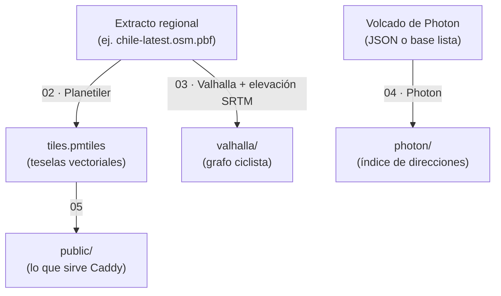

<!--
SPDX-FileCopyrightText: 2026 Gabriel Piñones
SPDX-License-Identifier: AGPL-3.0-or-later
-->

# Pipeline de Datos Geográficos — Baze

Scripts que generan, a partir de **un mismo extracto `.osm.pbf`**, todos los artefactos geográficos de Baze: el mapa que descarga la app, el grafo de ruteo ciclista con elevación y el índice de búsqueda de direcciones. El workflow [`data-smoke.yml`](../.github/workflows/data-smoke.yml) ejecuta estos mismos scripts sobre un extracto real de Mónaco y prueba los motores resultantes a través del backend, de modo que lo documentado aquí es lo que se verifica.

## 1. Fuente única de verdad

Para evitar inconsistencias (calles que existen en el mapa pero no en el grafo o en la búsqueda), todo se construye desde el mismo `.osm.pbf`, descargado el mismo día.



Photon es la excepción: no lee un `.osm.pbf` (ver el paso 4).

## 2. Requisitos

Docker, `curl`, `md5sum`/`sha256sum`, `python3` y, para el paso 4 con una base lista, `bzip2`. Los pasos que usan contenedores corren con **tu usuario** (`--user $(id -u):$(id -g)`): los datos quedan tuyos, y el mismo usuario es el que debes poner en `ENGINES_UID`/`ENGINES_GID` de `infra/.env` (`make dev-env` lo hace) para que Valhalla y Photon puedan leerlos. Todas las imágenes están **fijadas por digest** (o se construyen verificando un checksum): la misma entrada da la misma salida.

## 3. Artefactos (`data/out/`, ignorada por git)

| Ruta | Qué es | Quién la sirve |
|---|---|---|
| `extract.osm.pbf` y `.source` | Extracto verificado y su procedencia (URL, fecha, checksums) | Nadie (privado) |
| `tiles.pmtiles` | Teselas vectoriales (esquema OpenMapTiles) | Vía `public/` |
| `valhalla/` | `valhalla.json`, `valhalla_tiles.tar` y `elevation_tiles/` | Contenedor `valhalla`, en solo lectura |
| `photon/photon_data/` | Índice de búsqueda | Contenedor `photon` |
| `public/` | `tiles.pmtiles`, `tiles.pmtiles.sha256`, `manifest.json`, `styles/style.json` | Caddy en `/static` |
| `sources/`, `tmp/` | Descargas y temporales de Planetiler | Nadie |

Solo `public/` se monta en el proxy: el extracto, el grafo y el índice nunca se publican.

## 4. Ejecución paso a paso

Todo se ejecuta desde la raíz del repositorio (`make data-build` encadena 01, 02, 03 y 05, y el 04 si hay fuente de Photon).

### 01 · Descargar y verificar el extracto
```bash
bash data/scripts/01-download-extract.sh
```
`OSM_EXTRACT_URL` (https, por defecto Chile en Geofabrik). La descarga se **verifica contra el `.md5` que publica Geofabrik** antes de reemplazar `extract.osm.pbf`; para una URL sin `.md5`, da `OSM_EXTRACT_SHA256` (o `OSM_ALLOW_UNVERIFIED=1` solo para datos desechables). Un archivo truncado, corrupto o que no sea un PBF aborta el paso sin tocar el anterior.

### 02 · Teselas con Planetiler
```bash
bash data/scripts/02-build-pmtiles.sh
```
`PLANETILER_HEAP` (4g por defecto; Planetiler recomienda cerca de la mitad del tamaño del `.pbf`). Planetiler descarga además unos 1 GB de fuentes (polígonos de océano y Natural Earth) a `data/out/sources/`. Al terminar se comprueba que el resultado sea un PMTiles v3.

### 03 · Grafo de Valhalla con elevación
```bash
bash data/scripts/03-build-valhalla.sh
```
Corre dentro de la imagen oficial `ghcr.io/valhalla/valhalla` (`data/scripts/container/valhalla-build.sh`) con la salida montada en `/custom_files`, la misma ruta que usa el motor en ejecución, de modo que `valhalla.json` sirve en ambos. El orden es el que exige Valhalla: grafo hasta la etapa `build`, descarga de las teselas SRTM del área cubierta, y recién entonces la etapa `enhance` que convierte alturas en pendientes. **El paso falla si falta alguna tesela de elevación**: `valhalla_build_elevation` solo registra los errores de descarga, y un grafo sin elevación rutearía como si la ciudad fuera plana sin avisar. Cada reconstrucción parte de cero, así que un fallo nunca deja un grafo viejo en uso.

### 04 · Índice de Photon
Photon no importa un `.osm.pbf`: parte de una base de datos Nominatim o de un volcado. Elige **una** fuente (el script falla si no hay ninguna; no deja marcadores vacíos):

```bash
# a) Un volcado JSON de Photon (formato: komoot/photon, docs/json-dump-format-0.1.0.md).
#    data/fixtures/photon-monaco.jsonl es un ejemplo de seis lugares, el que usa el smoke test.
PHOTON_IMPORT_FILE=data/fixtures/photon-monaco.jsonl bash data/scripts/04-build-photon.sh

# b) Una base ya construida. GraphHopper publica copias semanales por país en
#    https://download1.graphhopper.com/public/ ; el «1.0» del nombre es el formato de base de datos y debe
#    coincidir con el de la versión de Photon de infra/photon/Dockerfile (1.3.0 usa 1.0).
PHOTON_DUMP_URL=https://download1.graphhopper.com/public/<ruta>/photon-db-<país>-1.0-latest.tar.bz2 \
PHOTON_DUMP_SHA256=<sha256 del archivo> bash data/scripts/04-build-photon.sh
```
El índice nuevo se construye en una carpeta aparte y se intercambia al final (nunca se descomprime sobre el viejo: corrompe los datos); reinicia el contenedor `photon` después. Para tener búsqueda sobre el **mismo** extracto que el resto, exporta un volcado desde una importación Nominatim con `photon dump-nominatim-db` y usa la opción a). Photon se construye con `infra/photon/Dockerfile`: no existe imagen oficial, así que se descarga el jar de la release y se verifica su sha256.

### 05 · Publicar
```bash
bash data/scripts/05-publish-static.sh
```
Copia las teselas y el estilo a `data/out/public/` (cada archivo se reemplaza de forma atómica y en el sitio, porque Caddy tiene el directorio montado), y escribe `tiles.pmtiles.sha256` y `manifest.json` (tamaño, checksum, fecha de los datos de OSM y atribución), que la app descarga primero para verificar el mapa. El estilo se valida antes de publicar (`scripts/check-style.py`).

## 5. El estilo del mapa

`styles/style.json` apunta a `pmtiles://{{PMTILES_URL}}`: la app sustituye el marcador por la URL local del archivo descargado (`file:///…/tiles.pmtiles`). No define `sprite` ni `glyphs` a propósito, porque no tiene capas de símbolos y una URL inalcanzable rompería el mapa sin conexión; cuando haya etiquetas habrá que publicar las fuentes y declararlas. La atribución de OpenStreetMap y OpenMapTiles va en la fuente (MapLibre la muestra sola). Se valida con `python3 scripts/check-style.py` (reglas propias: sin hosts ni rutas de un dispositivo, atribución, referencias válidas) y con el validador oficial de MapLibre en el smoke test.

## 6. Usarlo en el despliegue

```bash
make data-build                       # o los pasos de arriba
docker compose -f infra/compose.yaml --env-file infra/.env --profile engines up -d --build
# En infra/.env: ENGINES_ENABLED=true, y reinicia el backend
```
Ver `docs/operations.md` (sección «Motores y datos») para el orden completo, la memoria de cada motor y cómo actualizar los datos.

## 7. Qué verifica el smoke test

Sobre Mónaco: la descarga verificada, las teselas y el estilo (también con el validador de MapLibre), los archivos publicados y su manifiesto, el grafo **con elevación real**, el índice de Photon, y a través del backend: una ruta ciclista con ascenso y descenso, una búsqueda, el rodeo de un cierre confirmado por el motor real, el `404` cuando no hay forma de evitarlo, que los motores no publiquen puertos y que ni el texto buscado ni las coordenadas lleguen a ningún log. No prueba el tamaño real (Chile) ni el índice de GraphHopper: eso lo confirma quien despliega.
