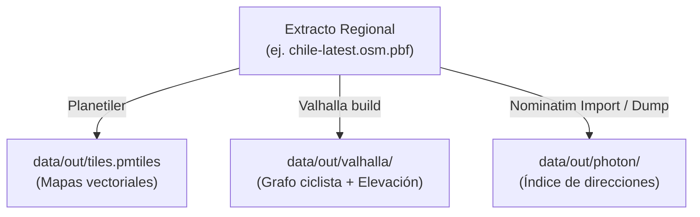

<!--
SPDX-FileCopyrightText: 2026 Gabriel Piñones
SPDX-License-Identifier: AGPL-3.0-or-later
-->

# Pipeline de Datos Geográficos — Baze

Este directorio contiene la especificación, scripts por etapas y estilos para generar de manera consistente y reproducible todos los artefactos geográficos de Baze a partir de **un mismo extracto `.osm.pbf`**.

## 1. Principio de Fuente Única de Verdad

Para evitar inconsistencias espaciales (por ejemplo, calles existentes en el mapa visual pero ausentes en el grafo de ruteo o en la búsqueda de direcciones), **todos los artefactos deben compilarse a partir del mismo archivo `.osm.pbf` descargado en la misma fecha**.



## 2. Artefactos Generados (`data/out/`)

Los artefactos se almacenan en `data/out/` (carpeta ignorada en git):
- `data/out/extract.osm.pbf`: Extracto crudo descargado.
- `data/out/tiles.pmtiles`: Archivo único de teselas vectoriales OpenMapTiles optimizado para lectura offline.
- `data/out/valhalla/`: Archivo `valhalla.json` y mosaicos del grafo (`tiles.tar` o directorio `valhalla_tiles/`) con datos de elevación SRTM integrados.
- `data/out/photon/`: Índice de búsqueda de Photon para consultas de autocompletado y geocodificación reversa.
- `data/out/public/`: lo único que Caddy sirve públicamente en `/static` (`tiles.pmtiles` y `styles/`). Lo genera `data/scripts/05-publish-static.sh`. El extracto crudo, el grafo y el índice **no** se publican.

## 3. Ejecución por Pasos

### Paso 1: Descargar extracto regional
```bash
bash data/scripts/01-download-extract.sh
```
Configura la URL de Geofabrik u otro proveedor mediante la variable de entorno `OSM_EXTRACT_URL`.

### Paso 2: Generar PMTiles con Planetiler
```bash
bash data/scripts/02-build-pmtiles.sh
```
Utiliza Planetiler (vía Docker o Java) para procesar el extracto completo en minutos en un único archivo `.pmtiles`.

### Paso 3: Compilar Grafo de Valhalla con Elevación
```bash
bash data/scripts/03-build-valhalla.sh
```
Genera la configuración optimizada para perfiles de bicicleta (`bicycle`) y descarga las teselas de elevación necesarias para calcular pendientes y dificultad altimétrica.

### Paso 4: Construir o Poblar Índice de Photon
```bash
bash data/scripts/04-build-photon.sh
```
> **Nota crítica sobre Photon:** Photon no importa directamente un `.osm.pbf` crudo en su binario estándar. Consulta la sección 4 y el script correspondiente.

---

## 4. Método de Ingesta en Photon

Photon fue diseñado para indexar jerarquías de direcciones ya resueltas. Existen dos métodos recomendados:

1. **Método Recomendado en Desarrollo (Dumps de Komoot)**:
   Descargar el extracto pre-indexado para la región o país desde el repositorio oficial de Photon (`https://photon.komoot.io/data/`).
2. **Método Estricto desde el mismo PBF (Pipeline Nominatim)**:
   Levantar una base de datos temporal de Nominatim, importar el `extract.osm.pbf` mediante `nominatim import`, y posteriormente ejecutar:
   `java -jar photon.jar -nominatim-import -host localhost -port 5432 -database nominatim -user nominatim`
   El script `04-build-photon.sh` implementa ambos caminos y documenta las variables requeridas.
