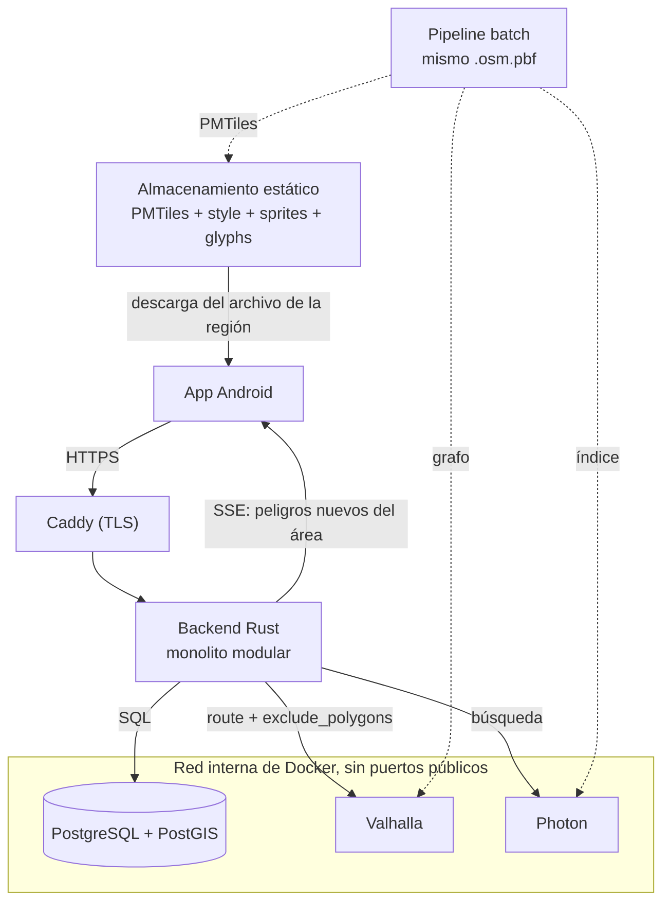

<!--
SPDX-FileCopyrightText: 2026 Gabriel Piñones
SPDX-License-Identifier: AGPL-3.0-or-later
-->

# Arquitectura del Sistema — Baze

## 1. Visión General y Diagrama

Baze es una aplicación de navegación colaborativa para ciclistas basada en Android (con arquitectura preparada para Kotlin Multiplatform e iOS en el futuro). La arquitectura sigue el patrón de **monolito modular** en el backend para maximizar la simplicidad operativa y la cohesión sin incurrir en la complejidad distribuida de microservicios, colas de mensajería (Kafka/RabbitMQ) o almacenes intermedios (Redis).



## 2. Componentes del Sistema

| Componente | Tecnología | Rol Principal |
|---|---|---|
| **App Móvil** | Kotlin, Jetpack Compose, MapLibre Native Android (≥ 11.7.0), Ktor Client, Koin | Mapa interactivo, geocodificación, navegación paso a paso, cálculo de proximidad y reportes comunitarios |
| **Backend** | Rust (edition 2024): Axum, Tokio, SQLx, reqwest, tower-http, tracing, utoipa | Único punto de entrada a la API, orquestación de ruteo, autenticación anónima y gestión de reportes |
| **Base de Datos** | PostgreSQL + PostGIS | Persistencia relacional y espacial: cuentas, reportes, votos comunitarios y consultas de proximidad (`ST_DWithin`, `ST_Intersects`) |
| **Ruteo** | Valhalla (con soporte de elevación) | Cálculo de rutas ciclistas con penalización de pendientes y evitación dinámica mediante `exclude_polygons` |
| **Geocodificación** | Photon | Búsqueda y autocompletado de direcciones, consumido exclusivamente como proxy a través del backend |
| **Mapa Base** | Planetiler → PMTiles (vector tiles), `style.json`, sprites y glifos | Archivos estáticos alojados en almacenamiento HTTP y consumidos offline por la app |
| **Proxy Reverso** | Caddy | Terminación TLS automática; único servicio expuesto en puertos públicos (80/443) |
| **Pipeline de Datos** | Scripts batch (Bash, Java/Docker) | Generación coherente de PMTiles, grafo Valhalla e índice Photon a partir de un **mismo extracto OSM** |

---

## 3. Reglas de Dominio

### 3.1. Tipos de Reportes y Afectación del Ruteo
- **Peligro Leve (`warning`)**: Ejemplos: vidrio en la ciclovía, baches, gravilla o escombros.
  - **Efecto**: Genera alertas visuales y sonoras en la app móvil cuando el ciclista se aproxima.
  - **Ruteo**: **No altera la ruta calculada**.
- **Bloqueo (`blocking`)**: Ejemplos: calle cortada, obra vial sin paso ciclista, inundación total.
  - **Efecto**: Afecta el motor de ruteo **únicamente cuando está confirmado**.
  - **Criterio de Confirmación**: Requiere alcanzar un umbral neto de votos positivos (`upvotes - downvotes >= THRESHOLD`), configurable vía variables de entorno. Los reportes no confirmados permanecen en estado tentativo y solo generan alertas de advertencia preventiva.

### 3.2. Ciclo de Vida y Expiración sin TTL
PostgreSQL no dispone de soporte nativo de TTL (Time-To-Live) por fila:
- Cada reporte almacena un campo `expires_at` (determinado por el tipo de peligro y votos acumulados).
- Todas las consultas activas (tanto de la API como de cruces espaciales de ruteo) filtran obligatoriamente con `WHERE expires_at > NOW()`.
- Un job periódico en segundo plano en el backend elimina físicamente los registros caducados de la base de datos para controlar el tamaño de las tablas e índices espaciales GiST.

### 3.3. Algoritmo de Re-ruteo con `exclude_polygons`
Para evitar enviar todos los reportes de una ciudad al motor de ruteo:
1. El backend recibe origen y destino y solicita a Valhalla la ruta ciclista base (`costing: bicycle`).
2. El backend extrae la geometría de la ruta (LineString) y ejecuta una consulta espacial en PostGIS buscando intersecciones con bloqueos confirmados vigentes:
   ```sql
   SELECT ST_AsGeoJSON(geom)
   FROM hazards
   WHERE hazard_type = 'blocking'
     AND status = 'confirmed'
     AND expires_at > NOW()
     AND ST_Intersects(geom, ST_Buffer(ST_GeomFromGeoJSON($1)::geography, 15)::geometry);
   ```
3. Si **no hay cruce**, se retorna de inmediato la ruta original.
4. Si **hay cruce**, se construyen polígonos delimitadores (buffers) alrededor de los bloqueos intersecados y se repite la petición a Valhalla agregando el parámetro `exclude_polygons`. Valhalla impone límites en la cantidad y tamaño de estos polígonos, garantizando que solo se envíen los obstáculos que efectivamente impactan la trayectoria.

### 3.4. Alertas de Proximidad en el Dispositivo y SSE Eficiente
- En la respuesta inicial de la ruta (`/api/v1/routing/route`), el backend incluye la lista de peligros vigentes dentro del corredor de la ruta (buffer de ~50 metros).
- La aplicación móvil evalúa en tiempo real y localmente la distancia entre la coordenada GPS actual y los puntos de peligro para disparar las alertas visuales o auditivas.
- El canal Server-Sent Events (SSE) `/api/v1/realtime/sse` suscribe a la app al bounding box de la ruta activa. Únicamente empuja **nuevos reportes** creados o actualizados en esa zona geográfica durante el trayecto.
- El servidor **no conoce ni almacena la posición GPS en vivo del usuario**, preservando la privacidad integral.

### 3.5. Modelo de Identidad y Mitigación de Abuso
- **Cuentas Anónimas**: Al abrir la app por primera vez, el cliente invoca `POST /api/v1/auth/anonymous`. El backend genera un identificador anónimo firmado (JWT o token opaco en base de datos).
- **Votación Única**: Se impone una restricción única `UNIQUE(hazard_id, account_id)` en la tabla de votos. Una cuenta solo puede emitir un voto (+1 o -1) por reporte.
- **Rate Limiting**: Rate limiting en el backend (aplicado mediante middleware de tower / governor) por cuenta de usuario y por IP para evitar spam o creación masiva de reportes falsos.

### 3.6. Mapas Vectoriales Autónomos y Modo Offline
- Las fuentes remotas tradicionales de PMTiles no proveen caché offline confiable en clientes móviles nativos.
- La aplicación Baze descarga el archivo `.pmtiles` de la región de interés al almacenamiento local del dispositivo.
- MapLibre Native Android lee directamente el archivo mediante la URL local `pmtiles://file:///...`.
- El mapa base permanece 100% operativo sin conectividad a Internet.
