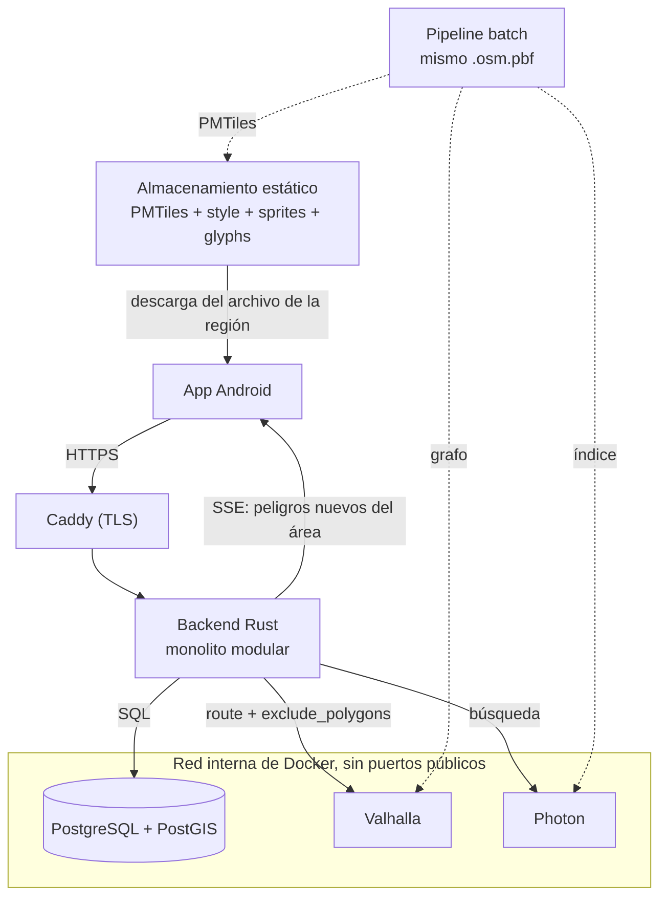

<!--
SPDX-FileCopyrightText: 2026 Gabriel Piñones
SPDX-License-Identifier: AGPL-3.0-or-later
-->

# Arquitectura del Sistema — Baze

## 1. Visión General y Diagrama

Baze es una aplicación de navegación colaborativa para ciclistas basada en Android (con arquitectura preparada para Kotlin Multiplatform e iOS en el futuro). La arquitectura sigue el patrón de **monolito modular** en el backend para maximizar la simplicidad operativa y la cohesión sin incurrir en la complejidad distribuida de microservicios, colas de mensajería (Kafka/RabbitMQ) o almacenes intermedios (Redis).



> **Estado de implementación**: el backend persiste cuentas, reportes y votos en PostGIS, autentica con tokens que caducan, aplica límites de abuso y publica el contrato OpenAPI. Los clientes de Valhalla (ruteo con evitación de cierres) y de Photon (búsqueda) están implementados y probados contra motores simulados y contra PostGIS real, pero **se activan con `ENGINES_ENABLED=true`**: apagado (el valor por defecto), `POST /api/v1/routing/route` y `GET /api/v1/geocoding/search` responden `501 Not Implemented`. Una ruta falsa con `200` sería un riesgo físico para quien la siga. Las imágenes y los datos de los motores reales aún no están verificados de punta a punta (ver `data/README.md`), por eso el valor por defecto sigue apagado.

## 2. Componentes del Sistema

| Componente | Tecnología | Rol Principal |
|---|---|---|
| **App Móvil** | Kotlin, Jetpack Compose, MapLibre Native Android (≥ 11.7.0), Ktor Client, Koin | Mapa interactivo, geocodificación, navegación paso a paso, cálculo de proximidad y reportes comunitarios |
| **Backend** | Rust (edition 2024): Axum, Tokio, SQLx, reqwest, tower-http, tracing, utoipa | Único punto de entrada a la API, orquestación de ruteo, autenticación anónima y gestión de reportes |
| **Base de Datos** | PostgreSQL + PostGIS | Persistencia relacional y espacial: cuentas, reportes, votos comunitarios y consultas de proximidad (`ST_DWithin`, `ST_Intersects`) |
| **Ruteo** | Valhalla (con soporte de elevación) | Cálculo de rutas ciclistas con penalización de pendientes y evitación dinámica mediante `exclude_polygons` |
| **Geocodificación** | Photon | Búsqueda y autocompletado de direcciones, consumido exclusivamente como proxy a través del backend |
| **Mapa Base** | Planetiler → PMTiles (vector tiles), `style.json`, sprites y glifos | Archivos estáticos alojados en almacenamiento HTTP y consumidos offline por la app |
| **Proxy Reverso** | Caddy | Terminación TLS automática; único servicio expuesto en puertos públicos (80/443) |
| **Pipeline de Datos** | Scripts batch (Bash, Java/Docker) | Generación coherente de PMTiles, grafo Valhalla e índice Photon a partir de un **mismo extracto OSM** |

---

## 3. Reglas de Dominio

### 3.1. Tipos de Reportes y Afectación del Ruteo
- **Peligro Leve (`warning`)**: Ejemplos: vidrio en la ciclovía, baches, gravilla o escombros.
  - **Efecto**: Genera alertas visuales y sonoras en la app móvil cuando el ciclista se aproxima.
  - **Ruteo**: **No altera la ruta calculada**.
- **Bloqueo (`blocking`)**: Ejemplos: calle cortada, obra vial sin paso ciclista, inundación total.
  - **Efecto**: Afecta el motor de ruteo **únicamente cuando está confirmado**.
  - **Criterio de Confirmación**: Requiere alcanzar un umbral neto de votos positivos (`upvotes - downvotes >= THRESHOLD`), configurable vía variables de entorno (2 a 50). Los reportes no confirmados permanecen en estado tentativo y solo generan alertas de advertencia preventiva.
- **Tipo derivado**: el servidor deduce el tipo de la categoría (`glass`, `pothole`, `debris` son `warning`; `road_closed`, `construction`, `flood` son `blocking`); el cliente no lo elige.
- **Retirada por la comunidad**: cuando `downvotes - upvotes >= THRESHOLD` el reporte, sea aviso o bloqueo, pasa a `resolved`. Es terminal: sale de los listados y ya no admite votos.

### 3.2. Ciclo de Vida y Expiración sin TTL
PostgreSQL no dispone de soporte nativo de TTL (Time-To-Live) por fila:
- Cada reporte almacena un campo `expires_at` (`HAZARD_DEFAULT_TTL_HOURS` después de su creación, 24 horas por defecto).
- Todas las consultas activas (tanto de la API como de cruces espaciales de ruteo) filtran obligatoriamente con `WHERE expires_at > NOW()` y excluyen los `resolved`.
- Un job periódico en segundo plano (cada cinco minutos y al arrancar) elimina físicamente, en lotes de 1000, los reportes caducados hace más de 24 horas; sus votos caen en cascada. Esas 24 horas de gracia son la ventana de los topes diarios por cuenta (ADR-0007). El job solo recupera espacio: las lecturas ya ignoran los caducados.

### 3.3. Algoritmo de Re-ruteo con `exclude_polygons`
Para evitar enviar todos los reportes de una ciudad al motor de ruteo:
1. El backend recibe origen y destino y solicita a Valhalla la ruta ciclista base (`costing: bicycle`).
2. El backend extrae la geometría de la ruta (LineString) y ejecuta una consulta espacial en PostGIS (`CorridorHazards`) buscando bloqueos confirmados vigentes cerca de ella. El índice GiST sobre `geom::geography` sirve a `ST_DWithin`, y cada bloqueo se devuelve como un polígono de exclusión (círculo de 30 m):
   ```sql
   SELECT ST_AsGeoJSON(ST_Buffer(geom::geography, 30, 4)::geometry)
   FROM hazards
   WHERE hazard_type = 'blocking'
     AND status = 'confirmed'
     AND expires_at > now()
     AND ST_DWithin(geom::geography, ST_SetSRID(ST_GeomFromGeoJSON($1), 4326)::geography, $2)
   ORDER BY created_at DESC LIMIT 501;
   ```
   Si hay más de 500 bloqueos en el corredor la consulta falla en lugar de truncar: una ruta que ignora un cierre que nunca se le comunicó es peor que ninguna ruta.
3. Si **no hay cruce**, se retorna de inmediato la ruta original.
4. Si **hay cruce**, se construyen polígonos delimitadores (buffers) alrededor de los bloqueos intersecados y se repite la petición a Valhalla agregando `exclude_polygons`. La ruta nueva **se vuelve a comprobar**: puede cruzar otros cierres, y entonces se repite (hasta 3 re-cálculos, 4 llamadas al motor como máximo por petición).
5. **Fail-closed**: una ruta que cruza un cierre confirmado nunca se entrega como si estuviera bien. Se responde un error cuando:
   - el motor devuelve otra vez una ruta que toca un cierre que se le pidió evitar (por ejemplo, el destino está dentro del área cerrada) o no hay ruta alternativa: `404`;
   - hacen falta más de 50 polígonos (límite del perímetro total de exclusiones de Valhalla, ver `MAX_EXCLUDE_POLYGONS`), más de 500 cierres en el corredor, o tras 3 re-cálculos aún aparecen cierres nuevos: `503` con `Retry-After`;
   - el motor falla o responde algo inválido: `502` genérico con `error_id` (el detalle va solo al log, sin coordenadas).
6. **Rutas largas**: el almacén acepta como máximo 10 000 puntos por corredor. La geometría se simplifica (Douglas-Peucker, tolerancia de 2 m, duplicada hasta 16 m si hace falta) y la búsqueda se ensancha en esa tolerancia, de modo que ningún cierre a 15 m de la ruta real puede perderse. La respuesta lleva la geometría completa. Origen y destino deben estar a lo sumo a 150 km en línea recta.

### 3.4. Alertas de Proximidad en el Dispositivo y SSE Eficiente
- En la respuesta inicial de la ruta (`/api/v1/routing/route`), el backend incluye la lista de peligros vigentes dentro del corredor de la ruta (buffer de ~50 metros).
- La aplicación móvil evalúa en tiempo real y localmente la distancia entre la coordenada GPS actual y los puntos de peligro para disparar las alertas visuales o auditivas.
- El canal Server-Sent Events (SSE) `/api/v1/realtime/sse` suscribe a la app al bounding box de la ruta activa. Únicamente empuja **nuevos reportes** creados o actualizados en esa zona geográfica durante el trayecto.
- El servidor **no conoce ni almacena la posición GPS en vivo del usuario**, preservando la privacidad integral.

### 3.5. Modelo de Identidad y Mitigación de Abuso
Detalle y justificación en [ADR-0007](adr/0007-identity-voting-and-abuse-limits.md) y [ADR-0008](adr/0008-database-roles-migrations-and-vote-networks.md).
- **Cuentas Anónimas**: Al abrir la app por primera vez, el cliente invoca `POST /api/v1/auth/anonymous`. El backend inserta una fila en `accounts` y devuelve un token `baze_v2.…` firmado con HMAC-SHA-256 que caduca (`AUTH_TOKEN_TTL_DAYS`). Cada petición autenticada verifica la firma y consulta la fila (`is_active`), de modo que banear una cuenta surte efecto de inmediato.
- **Votación Única**: Restricción `UNIQUE(hazard_id, account_id)` en la tabla de votos: una cuenta, un voto (+1 o -1) por reporte, que puede cambiar. El voto del creador es su primer voto.
- **Consenso por red**: solo el primer voto de cada subred (`/24` IPv4, `/64` IPv6) cuenta para el umbral. La red se guarda como una etiqueta HMAC con clave, nunca como dirección IP. Los votos de un mismo reporte se serializan con un bloqueo de fila.
- **Cuentas nuevas**: no pueden votar ni reportar bloqueos hasta cumplir `ACCOUNT_MIN_AGE_SECONDS` (600 s); cada cuenta tiene topes diarios de reportes y votos.
- **Rate Limiting**: middleware propio con memoria acotada, por red de cliente (la IP real, nunca una cabecera arbitraria) y por cuenta autenticada; toda respuesta 429 lleva `Retry-After`.

### 3.6. Mapas Vectoriales Autónomos y Modo Offline
- Las fuentes remotas tradicionales de PMTiles no proveen caché offline confiable en clientes móviles nativos.
- La aplicación Baze descarga el archivo `.pmtiles` de la región de interés al almacenamiento local del dispositivo.
- MapLibre Native Android lee directamente el archivo mediante la URL local `pmtiles://file:///...`.
- El mapa base permanece 100% operativo sin conectividad a Internet.

### 3.7. Persistencia, Roles y Migraciones
- Toda la información vive en PostgreSQL/PostGIS; el proceso del backend no guarda estado. Reiniciarlo no pierde reportes ni votos, y varias instancias podrían compartir la base de datos (el SSE sigue siendo en memoria por instancia, ver ADR-0001).
- El backend se conecta con `baze_app`, un rol que solo lee y escribe filas (ADR-0008). Las migraciones las aplica el servicio `migrate` con el rol dueño del esquema antes de que arranque el backend, que además verifica la versión del esquema al iniciar.
- Las consultas se escriben con `sqlx::query` en tiempo de ejecución; las pruebas con base de datos (`make backend-db-test`, y el CI con un servicio PostGIS) son lo que las valida.
